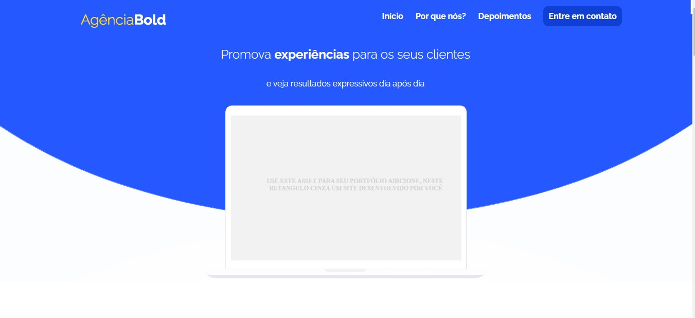
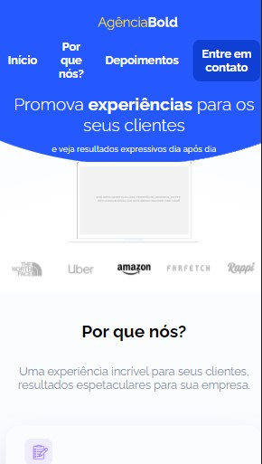

<h1 align="center">AgenciaBOLD</h1>
<h2 align="center">Projeto final do curso Front End 2.0 da Danki Code</h2>

A AgencyBold é uma agência de marketing fictícia para a qual criei um website responsivo como projeto final do curso Front-End Completo 2.0 oferecido pela Danki Code.

 O projeto do website está disponível [AQUI](https://xd.adobe.com/view/d9f79e73-0240-4ade-867e-7e07b8bf994a-8ca4/) 
 

No momento optei por não inserir o menu Hamburger e não por carrosel nas imagens de marca. O menu será inserido posteriormente com Bootstrap.

<b>Este projeto foi desenvolvido com as seguintes tecnologias:</b>
- HTML
- CSS
- JS
- Git & GitHub
- Adobe XD
- jQuery
